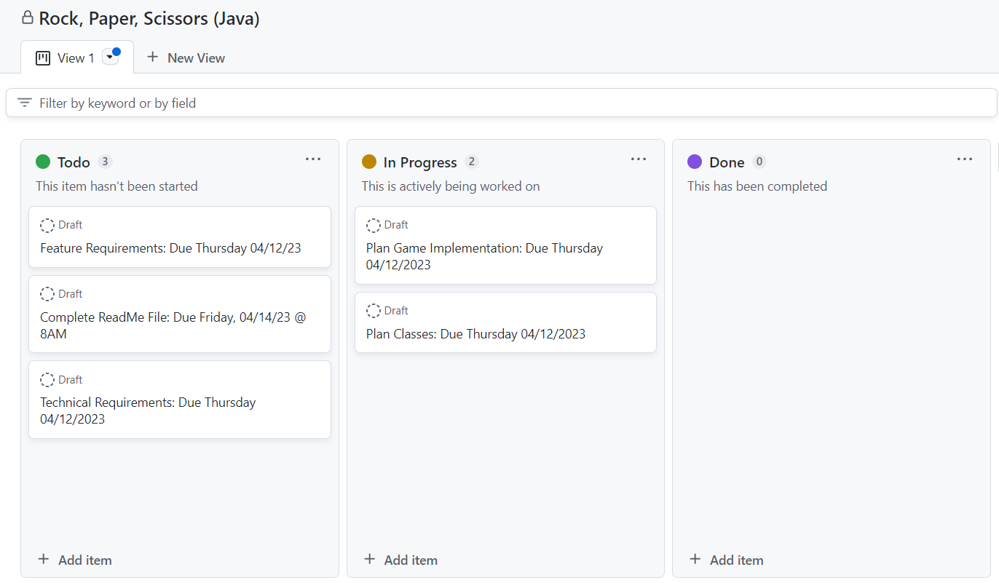
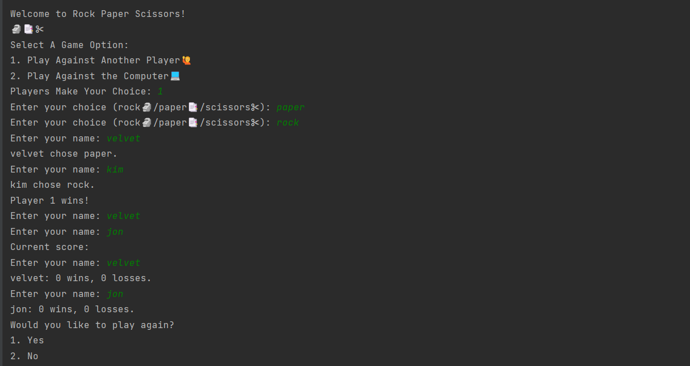

# Rock Paper Scissors :rock::page_facing_up::scissors:
<h1 xmlns="http://www.w3.org/1999/html">Introduction🦾</h1>

Looking for a fun and engaging way to spend your free time? Look no further than this simple 
Java implementation of rock-paper-scissors! With a user-friendly main menu that allows you to 
choose between playing against a human competitor or facing off against the computer, this game 
is perfect for gamers of all levels. Whether you're a seasoned veteran or a total newbie, you'll 
find hours of entertainment and excitement as you try to outwit your opponent with each turn. And 
when the game is over, the winner will be declared, leaving you with a sense of satisfaction and 
achievement. So what are you waiting for? Dive into the world of rock-paper-scissors today and 
see if you have what it takes to emerge victorious!

<h2>What is Rock, Paper, Scissors:question:</h2>

Rock, Paper, Scissors is a simple game, usually played in the form of a hand gestures, and popular 
amongst children. The purpose of the game is to reinforce quick thinking and simple decision-making. 
To determine a winner, the game decisions are based on the following:

<ul>
<li>Rock:rock:(crushes) beats Scissors:scissors:</li>
<li>Scissors:scissors:(cuts) beats Paper:page_facing_up:</li>
<li>Paper:page_facing_up:(covers) beats Rock:rock:</li>
</ul>
<h2>Installation</h2>

No installation is needed to play the game. You can simply fork this repository to your
personal Github repository, download the files to your Java IDE (IntelliJ, Eclipse, etc.), and
run the playGame (Main Class) to start the game.
<h1>The Planning Process🖋️</h1>

Again, I took a similar planning approach in this assignment before starting to code. I created
my <a href="https://github.com/users/vnpugh/projects/2/views/1?layout=board">Kanban Board</a>
in Github Projects to keep track of the technical requirements and identify the resources needed to complete 
the MVP (Minimum Viable Product). Also, creating a Kanban Board helps define the project's objectives,
identify the requirements, and reduce scope creep. 

<h1>Technical Requirements🏁</h1>
<ul>
<li>An array is used to store the game's history and the player's game wins, losses, or ties.✅</li>
<li>The player can play rock–paper–scissors against a computer player.✅</li>
<li>The player can play rock–paper–scissors against a human player.✅</li>
<li>The player will be shown a message after each turn for if they won, loss, or if the game is tied.✅</li>
<li>The game has a main menu with options to enter 2 players or play a game against the computer.✅</li>
<li>The game includes an abstract Player class and a RockPaperScissors Interface.✅</li>
<li>The Java Scanner is used to handle user input.✅</li>
<li>The random number generator is used to play against the computer.✅</li>
</ul>

<strong>Game Console</strong>

To add some engagement to the Java console, I added emoji's via unicode.

The game menu allows the player to select the option to 1. Play Against Another Player:raising_hand: or 2. Play
Against The Computer:computer:. If the player chooses to play against another player, the player will 
be prompted to enter their name, and make their choice (1-Rock:rock:,2-Paper:page_facing_up:, or 
3-Scissors:scissors:). Next, player 2 will also be prompted to enter their name, and make their 
choice. After both players make their choices, they will see a message displaying who won the game.
Additionally, the players will see games won/loss stats, which is part of the game's history.

<h1>Technologies & Tools Used🛠️</h1>
<ul>
 <li><strong>Project Management</strong></li>
 📋Github Projects (Kanban Board)
 <li><strong>Version Control</strong></li>
 🕛GitHub
 <li><strong>Developer Tools</strong></li>
⬛Git Bash (Command Line)
⬛IntelliJ (IDE)
➕Unicode
</ul>
<h1>My Thought Process:brain:</h1>

◾I initially created the <strong>RockPaperScissors</strong> interface with the play() method to be implemented by 
any class that implements the "RockPaperScissors" interface. I initially wanted the play() method 
take an integer as input representing the move made by the player, and return an integer representing
the result of the game. The result would be defined as 0 for a tie, 1 for a win, and -1 for a loss. However,
this method takes in no parameters and returns void after I decided to try another method.

◾I initially created the <strong>GameHistory</strong> class to keep track of the history of the game by recording the moves made by each player and the winner of each game. 
I also created three private instance variables: "player1Moves", "player2Moves", and "winners", all of which are of type ArrayList<String>. This class also has a constructor that initializes each of the three ArrayList variables to a new, empty ArrayList of type String. Additionally, this class has two public methods. The first method "addMove()" takes three String parameters which represents the moves
made by both players and the winner of the game. Next, these player moves and the winner are added to the respective ArrayList variables.
The second public method "printHistory()" does not take any parameters and prints a message "Game History:" to the console. I also
wanted to include this class to iterate through the size of the "player1Moves" ArrayList using a for loop and then the moves 
made by both players and the winner for each game will be printed to the console. Overall, the "printHistory()" method is used to display
the history of the game stats.

◾The <strong>ComputerPlayer</strong> class was created to represent a computer player, and this class extends the "Player"
class. The class overrides two methods: "getChoice()" and "getName()". The "getChoice()" method generates a random integer using 
the Java "Random" class and then uses a switch statement to convert that integer into one of three String choices: "rock", "paper", 
or "scissors". The chosen String is then returned from the method.  
I wanted to use a switch statement to handle the "getChoice" functionality to make the code more readable and maintainable 
compared to using a series of if-else statements. Finally, the "getName()" method returns the name of the player as "Computer".

◾The <strong>HumanPlayer</strong> class extends the "Player" class and incorporates a private instance variable named "scanner" that captures 
user input from the standard input stream. The constructor was initially created to take a String parameter "s" but, it 
initializes the "scanner" variable instead. I used a while loop to ensure that the user's input is valid (either "rock", "paper", 
or "scissors"). The while loop continuously prompts the user until valid input is given, and the chosen move is returned from 
the method. To enhance code readability and error handling, I included the @Override annotation for the "getChoice()" and 
"getName()" methods for best practice.  

◾The abstract <strong>Player</strong> class represents the state of a player in the game. I created the "win" and "lose" private instance variables which are initialized to 0.
Importantly, I identified the most important methods that should be included for this game to access the win/loss statistics 
of the player: 1. "getWin()", 2. "setWin()", 3. "getLose()", and 4. "setLose()".  
Next, I wanted to include two abstract methods: 1."getChoice()" and 2. "getName()". These methods do not have any implementation 
in the parent class, so they must be implemented by subclasses of the "Player" class because the implementation of these methods 
will be different for each player subclass. Overall, I wanted the Player class to provide a basic framework for creating different 
types of players with their own implementation for choosing moves and obtaining their name.

◾I created the <strong>PlayGame</strong> main class to control the game's flow. 
The getGameModeChoice() method is used to display the menu to the user and asks them to select a game option. The method 
returns an integer representing the player's choice: 1. for playing against another human player, and 2. for playing against 
the computer. Instead of using a switch statement, I have chosen to implement a while loop to manage the game's flow due to 
the uncertainty of how many times the user will engage in gameplay. The loop will continue until the user decides to 
the game, which is determined by the "getPlayAgainChoice()" method. During each iteration of the loop, the two 
players make their selections, the game documents their choices in the gameHistory ArrayList, and the game 
determines the winner based on the game rules. The winner's score is increased while the 
loser's score is decreased.  

◾

◾

◾

◾

<h1>What I Learned📚😖😣</h1>

◾Although all of the bonus items were not included in the Rock, Paper, Scissors Game, the project provided me with an opportunity 
to consider the game's implementation more deeply. My objective was to achieve the minimum viable product (MVP), and I believe 
I have accomplished that. I had to refactor my code multiple times as I attempted to implement different ideas that ultimately 
failed. For each feature, I rigorously tested to ensure that it was functioning correctly. Although there are still some rough 
patches that I am addressing to prevent errors, this process has honed my debugging and problem-solving skills.

◾Throughout this mini-project, I made many mistakes, but this presented an opportunity for finding new solutions and learning 
about advanced Java concepts. Building a simple game from scratch using Java has enabled me to acquire new skills that will be 
invaluable as I embark on more significant code bases. 

◾A switch statement can prove to be more efficient than a series of if-else statements because the switch statement's execution 
time does not depend on the number of cases it contains. Therefore, using a switch statement for this type of functionality is 
a good programming practice.

<h1>Icebox🧊</h1>
<h3>Here are some bonus features I would like to implement in the future:</h3>
<ul>
<li>:triangular_flag_on_post: Write automated JUnit tests for the game.</li>
<li>:triangular_flag_on_post: Add exception handling to respond to unexpected events such as bad user input.</li>
<li>Incorporate sound into the game via Processing.</li>
</ul>
<h1>Resources & Documentation Used⛑️</h1>
<ul>
<li>Programiz.com Tutorial: <a href="https://www.programiz.com/java-programming/enumsDOMContentLoaded">Learning About Enums</a></li>
<li>Stackoverflow: <a href="https://stackoverflow.com/questions/58819249/how-to-create-methods-for-a-rock-paper-scissors-game">Creating A Starter Rock, Paper, Scissors Game</a></li>
<li>Tutorialspoint.com: <a href="http://www.tutorialspoint.com/java/java_modifier_types.htm">Java Modifier Types</a></li>
<li>Stackoverflow: <a href="https://stackoverflow.com/questions/70918707/cannot-get-java-switch-statement-in-my-rock-paper-scissors-game-to-work-properly">Switch Statements</a></li>
<li>Stackoverflow: <a href="https://stackoverflow.com/questions/53794027/how-to-create-2-new-players-and-get-there-name-from-an-edittext-field">Adding Player Names in Text Fields</a></li>
<li>Stackoverflow: <a href="https://stackoverflow.com/questions/58819249/how-to-create-methods-for-a-rock-paper-scissors-game">Creating Methods in Paper, Rock, Scissors</a></li>
<li>Medium.com: <a href="https://medium.com/geekculture/how-to-code-a-simple-rock-paper-scissors-game-in-java-7ec5dda68be1">Rock-Paper-Scissors Game in Java</a></li>
<li>Java Documentation: <a href="https://docs.oracle.com/javase/8/docs/api/java/util/Random.html">Class Random</a></li>
</ul>
